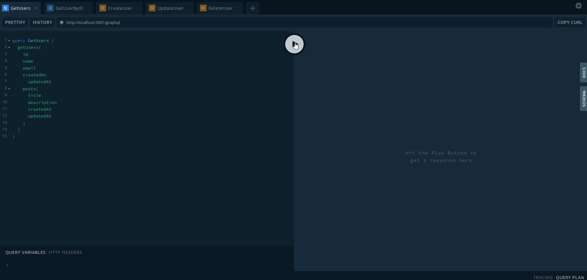

# Nest.js + GraphQL + PostgreSQL

## Installation

```bash
$ npm install
```

## Running the app

```bash
$ npm run start:dev
```

## Work

Type http://localhost:3001/graphql in browser and make request, mutation

<br>
<br>
